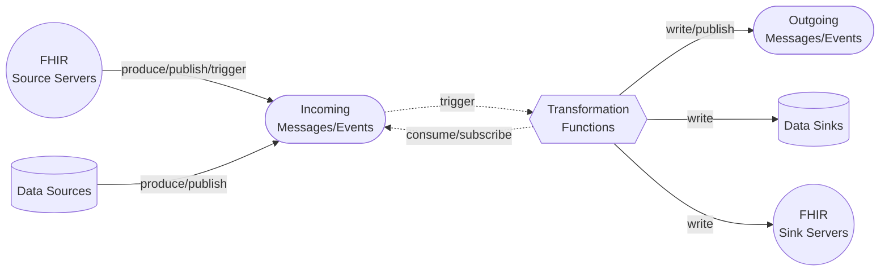

# FHIR Pipes 🔥
* Pieces of FHIR data pipelines
* Split up data processing in time and space using:
    * Event-Driven ETL (Extract, Transform, Load)
    * Scalable transformation functions
* More focused on comparing mapping and messaging implementations
* Less focused on orchestrating full pipelines
* Demonstrates examples of event-driven architecture and infrastructure-as-code
    * Applicable to other kinds of data processing not specific to FHIR

# Architecture

# ETL Implementations
### FHIR as Sink
- [x] [HL7v2 to FHIR with AWS Lambda & SQS (Java)](/functions/hl7-fhir-aws-lambda-sqs/) 
### FHIR as Source
- [x] [FHIR to Synthea with Azure Function & Service Bus Queue (C#)](/functions/synthea-fhir-azure-function-servicebus)

# Declarative Mappings
Data transformations can be more concise, readable, and easier to reason about when expressed declaratively. Here are some options worth exploring for encoding these transformations in data.
* [Microsoft](https://github.com/microsoft/FHIR-Converter)
    * [Liquid Templates](https://shopify.github.io/liquid/)
* [HL7](https://build.fhir.org/ig/HL7/v2-to-fhir/branches/master/mappings.html)
    * [ConceptMaps](https://build.fhir.org/conceptmap.html) 
* [Google](https://github.com/GoogleCloudPlatform/healthcare-data-harmonization/tree/master)
    * [Whistle Data Transformation Language](https://github.com/GoogleCloudPlatform/healthcare-data-harmonization/tree/master/wstl1/mapping_engine) - transpiled to Protocol Buffers
* [RDF](https://www.hl7.org/fhir/rdf.html) ?
    * RDF data can easily be mapped using predicates like `owl:equivalentClass` and `owl:equivalentProperty`